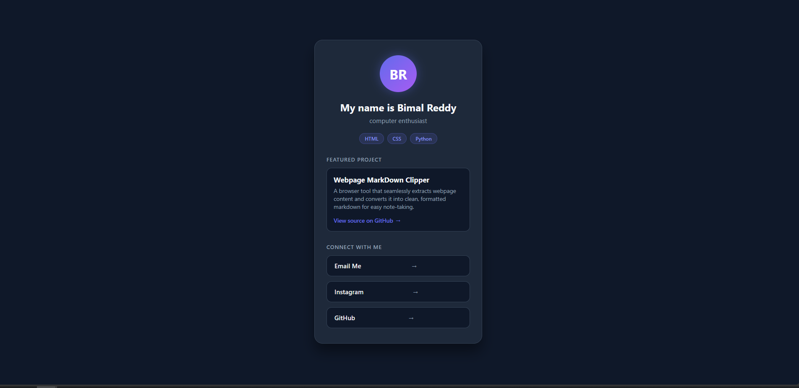

# Personal Profile Page

A clean, modern, dark-themed personal profile page built with HTML and CSS. Features skill badges, projects and interactive social links.

View the live hosted website here: [personal page](https://bimalreddy.github.io/Personal-Page/)

## Features
**Modern Dark UI**: Card layout featuring clean typography, custom CSS variables and hover animations.
**Featured Project:** Dedicated preview section showcasing the markdown clipper.
**Responsive Design:** Optimized for desktop and mobile viewing.
**Zero Dependencies:** Built entirely with standard HTML and CSS without any external framework.

## Authors
@BimalReddy

## Acknowledgements:
README format structered after [DomPizzie's template](https://gist.github.com/DomPizzie/7a5ff55ffa9081f2de27c315f5018afc)